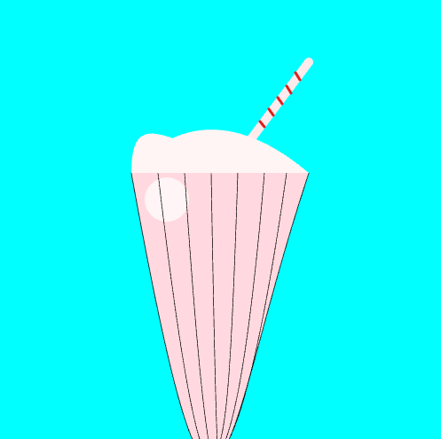
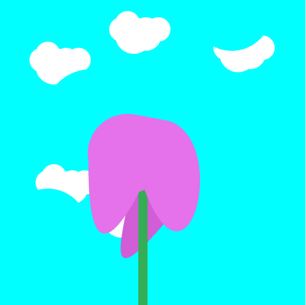
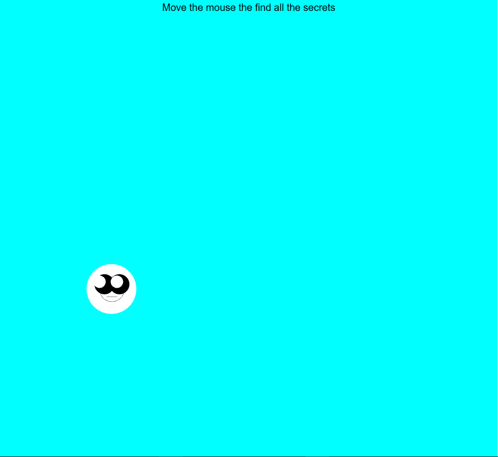

# Prototypes

## [Journal](journal.md)
## [README](README.md)

### First
- [3D Scene](https://sillysalmon33.github.io/cart253/prototypes/prototypes1/3D_model/index.html)
- [3D Scene Code](https://github.com/sillysalmon33/cart253/blob/main/prototypes/prototypes1/3D_model/js/3D_Model.js)

- [Yummy Milkshake 😋](https://sillysalmon33.github.io/cart253/prototypes/prototypes1/milkshake/index.html)
- [Yummy Milkshake 😋 Code](https://github.com/sillysalmon33/cart253/blob/main/prototypes/prototypes1/milkshake/js/Milkshake.js)

- [Flower](https://sillysalmon33.github.io/cart253/prototypes/prototypes1/flower/index.html)
- [Flower Code](https://github.com/sillysalmon33/cart253/blob/main/prototypes/prototypes1/flower/js/flower.js)

### Second
- [Find The Hidden Stuff](https://sillysalmon33.github.io/cart253/prototypes/prototypes2/Find_the_hidden_stuff/index.html)
- [Find The Hidden Stuff Code](https://github.com/sillysalmon33/cart253/blob/main/prototypes/prototypes2/Find_the_hidden_stuff/js/find%20the%20hidden%20stuff.js)

- [Patients Test](https://sillysalmon33.github.io/cart253/prototypes/prototypes2/patiants_test/index.html)
- [Patients Test Code](https://github.com/sillysalmon33/cart253/blob/main/prototypes/prototypes2/patiants_test/js/patients%20test.js)

- [Dont Scare Him](https://sillysalmon33.github.io/cart253/prototypes/prototypes2/dont_scare_him/index.html)
- [Dont Scare Him Code](https://github.com/sillysalmon33/cart253/blob/main/prototypes/prototypes2/dont_scare_him/js/dont%20scare%20him.js)

