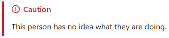

# cart253

.gif)

This website will be used to showcase the work done in Pippin Barr's CART253 class

# [Journal](journal.md)

## Prototypes

### First
- [3D Scene](https://sillysalmon33.github.io/cart253/prototypes/prototypes1/3D_model/index.html)
- [3D Scene Code](https://github.com/sillysalmon33/cart253/blob/main/prototypes/prototypes1/3D_model/js/3D_Model.js)

- [Yummy Milkshake 😋](https://sillysalmon33.github.io/cart253/prototypes/prototypes1/milkshake/index.html)
- [Yummy Milkshake 😋 Code](https://github.com/sillysalmon33/cart253/blob/main/prototypes/prototypes1/milkshake/js/Milkshake.js)

- [Flower](https://sillysalmon33.github.io/cart253/prototypes/prototypes1/flower/index.html)
- [Flower Code](https://github.com/sillysalmon33/cart253/blob/main/prototypes/prototypes1/flower/js/flower.js)

### Second
- [Find The Hidden Stuff](https://sillysalmon33.github.io/cart253/prototypes/prototypes2/Find_the_hidden_stuff/index.html)
- [Find The Hidden Stuff Code](https://github.com/sillysalmon33/cart253/blob/main/prototypes/prototypes2/Find_the_hidden_stuff/js/find%20the%20hidden%20stuff.js)
- [patients test](https://sillysalmon33.github.io/cart253/prototypes/prototypes2/patiants_test/index.html)
- [patients test Code](https://github.com/sillysalmon33/cart253/blob/main/prototypes/prototypes2/patiants_test/js/patients%20test.js)
- [dont scare him](https://sillysalmon33.github.io/cart253/prototypes/prototypes2/dont_scare_him/index.html)
- [dont scare him Code](https://github.com/sillysalmon33/cart253/blob/main/prototypes/prototypes2/dont_scare_him/js/dont%20scare%20him.js)

## Links

- [Markdown Cheat Sheet](https://www.markdownguide.org/cheat-sheet/)
- [Markdown Basic syntax](https://www.markdownguide.org/basic-syntax/)
- [Markdown Adv Syntax](https://www.markdownguide.org/extended-syntax/)
- [GitHub Video](https://www.youtube.com/watch?v=LxeclcePg-c)
- [GitHub Doc](https://docs.github.com/en/get-started/writing-on-github/getting-started-with-writing-and-formatting-on-github/basic-writing-and-formatting-syntax?utm_source=youtube-episode-6&utm_medium=video&utm_campaign=gfb-s3-2026)
- [Sparkle Text Generator](https://dagrand39.neocities.org/MainPages/MoreHTML/sparkleon/)
- [P5JS Refrence](https://p5js.org/reference/)

